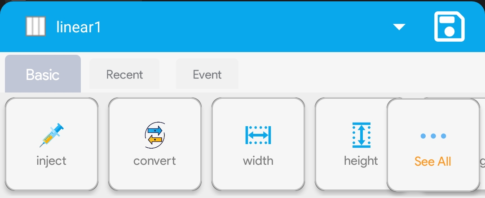
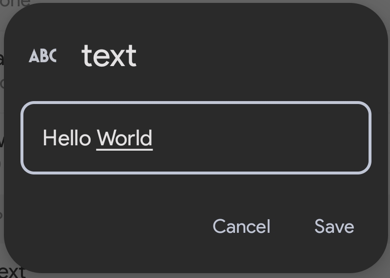

## View

A view is a graphical element of your app. It can be a button, text, image etc. Views construct the user interface of an Android app. Before you start programming your app, you must design it.

## Understanding views

On the left side of the screen, we have all the available views. Including Layouts, Widgets, etc.

## Building a basic app
### Linear (V)
It is a good idea to always add a Linear (V) inside your app first. Try to drag and drop it inside of the editor.
It should automatically stick to the left side of the screen, and a few options should've appeared at the bottom of the screen.

Choose the `width` option. Set it to `match_parent`.
Now it should be filling the entire screen. It is a good idea to add it before anything else so you can position the elements better and change the background.
Now, click on `See All`>`gravity` and check `center_vertical` & `center_horizontal`.
Press the back button to return to the main View editor.

### Button

Now from the left, under Widgets, there should be a Widget called "Button". Drag and drop it into the editor.
It should automatically be placed in the very bottom of the screen since we set the gravity of `linear1` to center horizontally and vertically.
Click `See All` on the bottom of the screen again and scroll down till you see a option called `text`. Set the text to anything. I'll set it to 'Hello World'

Click Save.

Now, we've created the button. But it doesn't do anything, right? It just barely sits there alone without any use. Let's make it do something.
